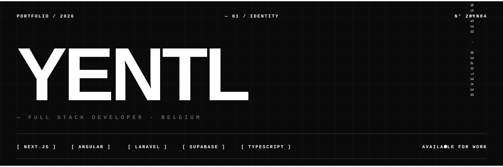

<div align="center">



</div>

<br>

```
─────────────────────────────────────────────────────────────────────
  LOCATION                   Belgium  ·  EU
─────────────────────────────────────────────────────────────────────
```

<br>

## ▰ &nbsp; STACK

```
  FRONTEND    Next.js   Angular   React   TypeScript   Tailwind   GSAP   Leaflet   Vite
  BACKEND     Laravel   Livewire   PHP   Python   Node.js   Supabase   PostgreSQL
  SECURITY    Honeypots   Firewalls   Malware Analysis   PowerShell   Bash
  DESIGN      Figma   Illustrator   Photoshop
  TOOLS       Git   GitHub   Vercel   VS Code
```

<br>

## ▰ &nbsp; SELECTED WORK

**[KotKompas](https://github.com/woutvanlommel/KotKompas)** &nbsp;·&nbsp; student-housing review platform &nbsp;`public`
<br><sub>Built the KotScore engine — Bayesian rating, anti-manipulation, review privacy by design — plus the review-invitation flow and auth. 180+ commits.</sub>
<br>`Laravel` &nbsp;`Livewire` &nbsp;`Filament` &nbsp;`PostgreSQL`

<br>

**Coeus** &nbsp;·&nbsp; white-label knowledge base &nbsp;`private`
<br><sub>Local-first desktop app over your own docs — cited answers, swappable AI providers, offline. Ynarchive product.</sub>
<br>`Next.js` &nbsp;`TypeScript` &nbsp;`Tauri` &nbsp;`RAG`

<br>

**Ynarchive — Portfolio** &nbsp;·&nbsp; studio site &nbsp;`in progress`
<br><sub>Scroll-driven, frontend. The home of my own builds and client work.</sub>
<br>`Next.js` &nbsp;`GSAP` &nbsp;`Three.js`

<br>


</div>

<br>

<div align="center">

`NL` &nbsp;·&nbsp; `EN` &nbsp;·&nbsp; `20YN04`

<sub>Graduating June 2026 &nbsp;·&nbsp; open to full-stack & AI engineering roles</sub>

<sub>↳ Always shipping.</sub>

</div>
