<div align="center">

<h3><code>yentl@ynarchive ~ $ git log --graph --oneline --all</code></h3>



<br><br>

<h3><code>yentl@ynarchive ~ $ neofetch</code></h3>


<br><br>

<h3><code>yentl@ynarchive ~ $ ./contributions.sh</code></h3>


</div>

<br>

## ▰ &nbsp; SELECTED WORK

**[KotKompas](https://github.com/woutvanlommel/KotKompas)** &nbsp;·&nbsp; student-housing review platform &nbsp;`public`
<br><sub>Built the KotScore engine — Bayesian rating, anti-manipulation, review privacy by design — plus the review-invitation flow and auth. 180+ commits.</sub>
<br>`Laravel` &nbsp;`Livewire` &nbsp;`Filament` &nbsp;`PostgreSQL`

<br>

**Coeus** &nbsp;·&nbsp; white-label knowledge base &nbsp;`private`
<br><sub>Local-first desktop app over your own docs — cited answers, swappable AI providers, offline. Ynarchive product.</sub>
<br>`Next.js` &nbsp;`TypeScript` &nbsp;`Tauri` &nbsp;`RAG`

<br>

**Ynarchive — Portfolio** &nbsp;·&nbsp; studio site &nbsp;`in progress`
<br><sub>Scroll-driven, frontend. The home of my own builds and client work.</sub>
<br>`Next.js` &nbsp;`GSAP` &nbsp;`Three.js`

<br>

## ▰ &nbsp; HOW THIS PAGE IS BUILT

<details>
<summary>Three SVGs, no third-party services</summary>

<br>

GitHub strips `<script>` and inline CSS from a README, but it renders SVGs
embedded through `` with their animation intact. So every moving part
lives inside the SVG file itself. Nothing here calls out to a badge service,
so nothing here can rate-limit, go down, or start showing an ad.

| File | What it is |
| --- | --- |
| `ascii-branches.svg` | The branch graph, drawn as ASCII and swept in left to right. |
| `info-card.svg` | Neofetch-style card. The uptime line reads the real contribution data. |
| `contrib-heatmap.svg` | 53 weeks × 7 days, scraped from the public profile page. No token needed. |

```bash
python -m venv .venv && source .venv/bin/activate
pip install -r scripts/requirements.txt

python scripts/make_ascii_svg.py          # branch graph
python scripts/fetch_contributions.py     # data/contributions.json
python scripts/render_heatmap_svg.py      # heatmap
python scripts/make_info_card.py          # card, reads the json above

STATIC=1 python scripts/make_ascii_svg.py # frozen frame, for previewing
```

`.github/workflows/update-profile-art.yml` runs the last three every morning
and commits the result, so the graph and the streak stay current on their own.

</details>

<br>

<div align="center">

`NL` &nbsp;·&nbsp; `EN` &nbsp;·&nbsp; `20YN04`

<sub>open to full-stack & AI engineering roles</sub>

<sub>↳ Always shipping.</sub>

</div>
